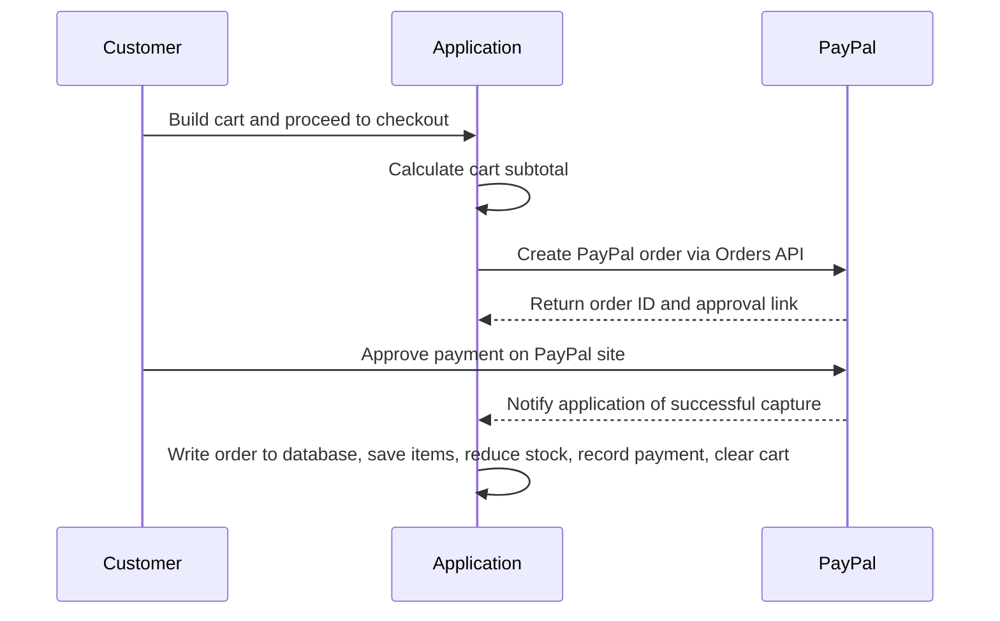

# CarryHub

CarryHub is a full-stack e-commerce web application built with Node.js, Express, EJS, and PostgreSQL. It supports customer shopping, cart and checkout flows, PayPal payments, and an admin area for managing products, categories, orders, and customers.

## Features

### Customer Experience
- User registration, login, logout, and session-based authentication
- Personalized profile page with order summary
- Product browsing with category filtering
- Product detail pages
- Shopping cart with quantity adjustment and item removal
- Checkout flow with shipping details and order placement
- Order history and order detail pages
- Order success confirmation page
- Contact page

### Payments
- PayPal integration for checkout payments
- PayPal order creation through the Orders API
- PayPal payment capture and confirmation
- Automatic order creation after successful payment
- Payment transaction tracking in the database
- Cart total conversion for PayPal payment amount calculation

### Admin Panel
- Admin dashboard with business overview metrics
- Product management
- Category management
- Order management and order status updates
- Customer management and customer details view
- Recent orders and low-stock product insights

### Technical Features
- PostgreSQL-backed data storage
- EJS server-side rendering
- Express session authentication
- Role-based access control for customer and admin routes
- Modular controller, service, and middleware structure
- Static asset serving for CSS, JavaScript, and images

## Tech Stack

- Node.js
- Express.js
- EJS
- PostgreSQL
- express-session
- bcrypt
- axios
- PayPal Orders API

## Project Structure

```text
app.js
package.json
public/
src/
  config/
  controllers/
  database/
  middleware/
  routes/
  services/
  utils/
  views/
```

## Prerequisites

- Node.js 18 or later
- PostgreSQL
- A PayPal developer account for payment credentials

## Environment Variables

Create a `.env` file in the project root and define the following variables:

```env
PORT=3000
SESSION_SECRET=your_session_secret

DB_HOST=localhost
DB_PORT=5432
DB_NAME=carryhub
DB_USER=postgres
DB_PASSWORD=your_password

SALT_ROUNDS=10

PAYPAL_BASE_URL=https://api-m.sandbox.paypal.com
PAYPAL_CLIENT_ID=your_paypal_client_id
PAYPAL_CLIENT_SECRET=your_paypal_client_secret
```

If you are using PayPal live credentials, update `PAYPAL_BASE_URL` accordingly.

## Installation

1. Clone the repository.
2. Install dependencies:

```bash
npm install
```

3. Create the PostgreSQL database and run the schema:

```bash
psql -U postgres -d carryhub -f src/database/schema.sql
```

4. Load seed data if needed:

```bash
psql -U postgres -d carryhub -f src/database/seed.sql
```

5. Configure your `.env` file.
6. Start the application:

```bash
npm start
```

For development, use:

```bash
npm run dev
```

## Available Scripts

- `npm start` - starts the application in production mode
- `npm run dev` - starts the application with nodemon for local development

## Main Routes

### Public Pages
- `/` - Home page
- `/login` - Login page
- `/register` - Registration page
- `/products` - Product listing
- `/products/:id` - Product details
- `/categories` - Category listing
- `/contact` - Contact page

### Customer Routes
- `/cart` - Shopping cart
- `/checkout` - Checkout page
- `/orders` - Order history
- `/orders/:orderId` - Order details
- `/profile` - Customer profile
- `/order-success/:orderId` - Order success page

### Authentication API
- `POST /api/auth/register`
- `POST /api/auth/login`
- `POST /api/auth/logout`
- `GET /api/auth/profile`

### Cart and Checkout API
- `POST /api/cart/add`
- `POST /api/cart/add/:productId`
- `POST /api/cart/items/:cartItemId/adjust`
- `POST /api/cart/items/:cartItemId/remove`
- `GET /api/cart`
- `POST /checkout`

### Payment API
- `POST /api/paypal/create-order`
- `POST /api/paypal/capture-order`

### Admin Routes
- `/admin/dashboard`
- `/admin/products`
- `/admin/categories`
- `/admin/orders`
- `/admin/orders/:orderId`
- `/admin/customers`

## Payments Flow mermaid


1. The customer builds a cart and proceeds to checkout.
2. The application calculates the cart subtotal.
3. A PayPal order is created through the PayPal Orders API.
4. After successful capture, the order is written to the database.
5. Order items are saved, stock is reduced, payment details are recorded, and the cart is cleared.

## Notes

- Access to customer pages requires login.
- Admin features require an account with the `admin` role.
- Cart item counts are stored in the session-aware layout and updated per user.
- Images, styles, and client-side scripts are served from the `public` directory.

## Developers
- [Gwamaka Mwakabuta](https://github.com/ProducerG-hub)
- [David Francis](https://github.com/DAV-cloud764)
- [Stephen Chibwaye](https://github.com/KiboySE)

## License

ISC